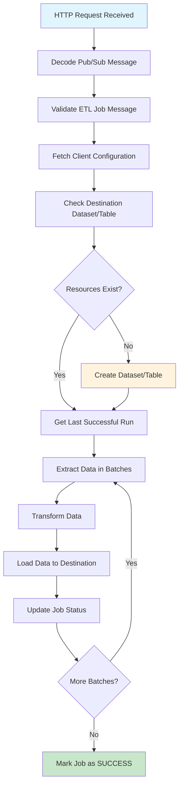

# BigQuery Cross-Environment ETL Pipeline

## Overview

The Billing ETL Service is a serverless application that automates the extraction, transformation, and loading (ETL) of billing data from Google BigQuery across multiple organizations. It manages datasets, job status tracking, and provides robust error handling through a MySQL database backend.

## Architecture

```
┌─────────────────┐    ┌──────────────────┐    ┌─────────────────┐
│   HTTP Request  │───▶│  Cloud Function  │───▶│   BigQuery      │
│   (Pub/Sub)     │    │   (main.py)      │    │   (Source)      │
└─────────────────┘    └──────────────────┘    └─────────────────┘
                                │
                                ▼
                       ┌──────────────────┐    ┌─────────────────┐
                       │   MySQL DB       │    │   BigQuery      │
                       │ (Config/Status)  │    │ (Destination)   │
                       └──────────────────┘    └─────────────────┘
```

## Project Structure

```
pulse_billing_etl_service/
├── main.py                     # Entry point and HTTP handler
├── requirements.txt            # Python dependencies
└── core/
    ├── constants.py           # Configuration and environment variables
    ├── bigquery/
    │   └── client.py          # BigQuery client abstraction
    ├── database/
    │   ├── billing_etl_db.py  # High-level database operations
    │   └── database_class.py  # MySQL connection and query execution
    ├── models/
    │   └── billing_etl_model.py # Pydantic data models
    ├── services/
    │   └── billing_etl.py     # Main ETL business logic
    └── utility/
        ├── dataset_utils.py   # BigQuery dataset/table management
        ├── logger.py          # Structured logging utility
        ├── return_type.py     # HTTP response formatting
        └── sa_utils.py        # Service account credential loading
```

## Core Components

### 1. Entry Point (`main.py`)
- **Purpose**: HTTP request handler for Cloud Functions/Cloud Run
- **Responsibilities**:
  - Decode and validate Pub/Sub messages
  - Trigger ETL process via `process_etl_job`
  - Handle errors and logging
  - Return appropriate HTTP responses

### 2. Configuration (`core/constants.py`)
- **Purpose**: Centralized configuration management
- **Features**:
  - Environment variable loading
  - Database credentials
  - Project settings
  - Retry configurations

### 3. Data Models (`core/models/billing_etl_model.py`)
- **Purpose**: Data validation and structure definition
- **Components**:
  - Pydantic models for ETL job messages
  - Status tracking models
  - Custom exception classes
  - Payload validation

### 4. Database Layer (`core/database/`)

#### `database_class.py`
- **Purpose**: MySQL connection and query execution
- **Features**:
  - SQLAlchemy-based database management
  - Connection pooling
  - Query execution utilities

#### `billing_etl_db.py`
- **Purpose**: High-level database operations
- **Key Methods**:
  - `save_etl_job_status()` - Track job progress
  - `get_last_successful_etl_run()` - Resume from last checkpoint
  - `get_client_billing_config()` - Fetch organization settings
  - `update_step_status()` - Mark completion of ETL steps

### 5. BigQuery Integration (`core/bigquery/client.py`)
- **Purpose**: BigQuery client abstraction
- **Features**:
  - Dataset and table management
  - Query execution
  - Batch data operations
  - Resource cleanup

### 6. ETL Service (`core/services/billing_etl.py`)
- **Purpose**: Main ETL orchestration logic
- **Workflow**:
  1. Parse and validate job messages
  2. Fetch client configuration
  3. Ensure destination resources exist
  4. Extract data in batches
  5. Transform data (placeholder for custom logic)
  6. Load data to destination
  7. Update job status

### 7. Dataset Management (`core/utility/dataset_utils.py`)
- **Purpose**: BigQuery resource management
- **Features**:
  - Dataset creation and verification
  - Table schema management
  - Configuration updates
  - Resource cleanup

### 8. Utilities (`core/utility/`)
- **`logger.py`**: Structured JSON logging
- **`return_type.py`**: HTTP response formatting
- **`sa_utils.py`**: Service account credential management

## ETL Process Flow



## Key Technologies

- **Google BigQuery**: Data extraction and loading
- **MySQL**: Configuration and status tracking
- **SQLAlchemy**: Database ORM
- **Pydantic**: Data validation and serialization
- **Google Service Accounts**: Secure BigQuery access
- **Cloud Functions/Cloud Run**: Serverless execution

## Configuration

### Environment Variables
```bash
# Database Configuration
DB_HOST=your-mysql-host
DB_USER=your-db-user
DB_PASSWORD=your-db-password
DB_NAME=pulse_billing_etl

# Google Cloud Configuration
PROJECT_ID=your-gcp-project
SERVICE_ACCOUNT_FILE=path/to/service-account.json

# ETL Configuration
BATCH_SIZE=1000
MAX_RETRIES=3
RETRY_DELAY=5
```

### Dependencies (`requirements.txt`)
```txt
protobuf
pydantic
SQLAlchemy
google-cloud-bigquery
mysql-connector-python
```

## Database Schema

### ETL Jobs Table
```sql
CREATE TABLE etl_jobs (
    id INT AUTO_INCREMENT PRIMARY KEY,
    organization_id VARCHAR(255),
    job_id VARCHAR(255),
    status ENUM('IN_PROGRESS', 'SUCCESS', 'FAILED'),
    created_at TIMESTAMP DEFAULT CURRENT_TIMESTAMP,
    updated_at TIMESTAMP DEFAULT CURRENT_TIMESTAMP ON UPDATE CURRENT_TIMESTAMP,
    error_message TEXT
);
```

### Client Configuration Table
```sql
CREATE TABLE client_billing_config (
    id INT AUTO_INCREMENT PRIMARY KEY,
    organization_id VARCHAR(255),
    source_dataset VARCHAR(255),
    destination_dataset VARCHAR(255),
    destination_table VARCHAR(255),
    last_successful_run TIMESTAMP,
    created_at TIMESTAMP DEFAULT CURRENT_TIMESTAMP
);
```

## Deployment

### Google Cloud Functions
```bash
gcloud functions deploy pulse-billing-etl \
    --runtime python39 \
    --trigger-http \
    --entry-point main \
    --memory 512MB \
    --timeout 540s \
    --set-env-vars PROJECT_ID=your-project-id
```

### Google Cloud Run
```bash
gcloud run deploy pulse-billing-etl \
    --source . \
    --platform managed \
    --region us-central1 \
    --memory 1Gi \
    --cpu 1 \
    --max-instances 10
```

## Error Handling

The service implements comprehensive error handling:

- **Validation Errors**: Invalid job messages are rejected with detailed error responses
- **Database Errors**: Connection failures and query errors are logged and retried
- **BigQuery Errors**: API errors are handled with exponential backoff
- **Batch Processing**: Failed batches are retried individually
- **Status Tracking**: All job statuses are persisted for monitoring

## Monitoring and Logging

### Log Structure
```json
{
    "timestamp": "2024-01-15T10:30:00Z",
    "level": "INFO",
    "service": "pulse-billing-etl",
    "organization_id": "org-123",
    "job_id": "job-456",
    "message": "ETL job completed successfully",
    "metadata": {
        "records_processed": 1500,
        "duration_seconds": 45
    }
}
```

### Key Metrics
- Job success/failure rates
- Processing duration
- Records processed per job
- Error frequency by type
- Resource utilization

## Extending the Service

### Adding Custom Transformations
```python
# In core/services/billing_etl.py
def transform_data(self, raw_data):
    """
    Custom transformation logic
    """
    # Add your transformation logic here
    transformed_data = []
    for record in raw_data:
        # Apply transformations
        transformed_record = self.apply_custom_rules(record)
        transformed_data.append(transformed_record)
    
    return transformed_data
```

### Adding New Data Sources
1. Extend the BigQuery client in `core/bigquery/client.py`
2. Update the data models in `core/models/billing_etl_model.py`
3. Modify the ETL service to handle new data formats
4. Update database schema if needed

### Custom Alerting
```python
# Add to core/services/billing_etl.py
def send_alert(self, job_status, error_details=None):
    """
    Send alerts for job failures or important events
    """
    if job_status == "FAILED":
        # Send notification via email, Slack, etc.
        pass
```

## Best Practices

1. **Idempotency**: ETL jobs are designed to be rerunnable
2. **Incremental Processing**: Only process new data since last successful run
3. **Batch Processing**: Handle large datasets efficiently
4. **Error Recovery**: Comprehensive retry logic with exponential backoff
5. **Monitoring**: Structured logging for observability
6. **Security**: Service account-based authentication
7. **Scalability**: Stateless design for horizontal scaling

## Troubleshooting

### Common Issues

1. **Authentication Errors**
   - Verify service account permissions
   - Check BigQuery API access

2. **Database Connection Issues**
   - Validate MySQL credentials
   - Check network connectivity

3. **Memory Errors**
   - Reduce batch size in configuration
   - Increase Cloud Function memory allocation

4. **Timeout Issues**
   - Increase timeout settings
   - Optimize query performance
   - Consider breaking large jobs into smaller chunks

### Debug Mode
Enable debug logging by setting environment variable:
```bash
LOG_LEVEL=DEBUG
```

## Support and Maintenance

- **Log Analysis**: Use Cloud Logging for troubleshooting
- **Performance Monitoring**: Track job duration and resource usage
- **Data Quality**: Implement data validation checks
- **Backup Strategy**: Regular database backups
- **Version Control**: Tag releases for rollback capability
